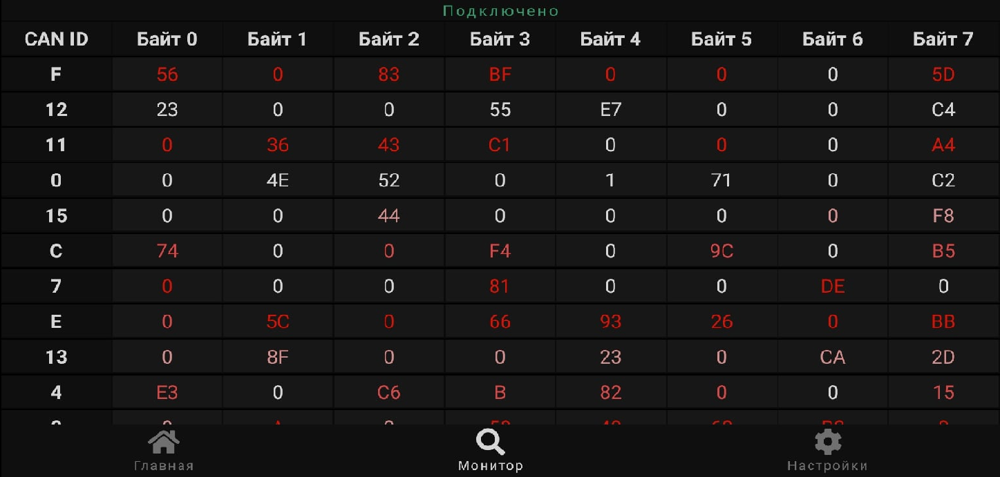

CAN-viewer
---

Данная разработка позволяет считывать показания с шины CAN и отображать их на смартфоне в псевдо-реалтайме.  
Проект разделен на 2 части - серверную и клиентскую. 
В качестве сервера выступает сам контроллер, который необходимо предварительно прошить готовым образом + физически соединить с шиной данных 
Основные этапы по конфигурации программатора / работе с энергонезависимой памятью описаны на официальном сайте производителя: 
https://docs.espressif.com/projects/esptool/en/latest/esp32/esptool/flashing-firmware.html

### Сервер:
Аппаратная часть: ESP32, VP251 
Технологии: freeRTOS, lwip, TWAI

### Клиент:
Технологии: react-native-...wifi, elements, router, tcp 
